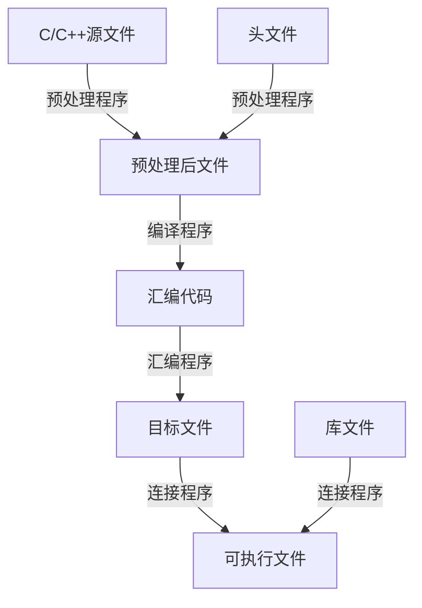

# Popular development tools

UNIX/Linux系统提供了丰富的应用程序和实用工具，如文本处理工具、软件开发工具、大量的公用程序、方便的图形用户界面、高效的电子邮件、强大的网络通信系统，以及系统维护工具和对数据库的广泛支持。所以UNIX/Linux系统是具有广泛用途的性能很好的应用环境。

目前Linux系统主要为用户提供gcc,gdb,make,CVS,Perl等常用开发工具。CVS(Concurrent version system)是一个优秀的版本管理与控制工具，深受开发人员与系统管理的喜爱，用来记录对源文件的修改，同时也是管理其他日常文档(如word)的一个强有力的工具。Perl(practical extraction and report language)是一种解释性高级程序设计语言，是目前流行的Web应用软件和CGI脚本开发软件。开发Perl最初是用于文本操作，现在它的应用范围很广，包括系统管理、Web开发、网络编程、GUI开发和更多的用途。==Perl程序可以直接运行无需编译==。同一Perl程序可以在不同的操作系统上运行，如UNIX，Linux，Windows，OS等。

本次主要讲解Linux系统下几个常用的软件开发工具(C和C++语言编译系统gcc，gdb调试工具)和程序维护工具make。

## gcc编译系统

UNIX/Linux系统支持众多程序设计语言，而C语言是其宿主语言，所以在UNIX/Linux环境下，C语言用的最好，也用的最多。C++是扩展的C语言，它在C语言的基础上成功地实现了面向对象程序设计思想，提供了从C语言转换到更高级程序设计理想的途径。目前Linux平台上最常用的C语言编译系统是**gcc(GNU Compiler Collection)**，它是GNU项目中符合ANSI C标准的编译系统，**能够编译用C，C++和Objective- C等语言编写的程序**。

- 常用文件名后缀及其表示的文件类型
    
    [Untitled](https://www.notion.so/7e374580d6b34292a1a34be726551f98)
    

### C语言编译过程

一个完整的C语言程序可以存放在多个文件中，包括C语言源文件、头文件及库文件。头文件不能单独进行编译，它必须随C语言源文件一起进行编译。

gcc编译程序时，其编译过程可分为4个阶段：`Preprocessing`, `Compiling`, `Assembling`, `Linking`并且始终按照这个顺序执行——***预处理、编译、汇编、连接***。

将一个程序编译成可执行程序的步骤：



- 预处理阶段
    - 预处理是常规编译之前预先进行的工作，故此得名。它读取C语言源文件，对其中以#开头的指令（伪指令）和特殊符号进行处理。伪指令主要包括文件包含、宏定义和条件编译指令。预处理程序(preprocessor)将以#include行所指出的文件替代该指令行，包含的文件可能是大量的宏定义、各种外部符号的声明及另外的头文件。文件包含有两种形式：
        
        ```c
        #include <filename>#include "filename"
        ```
        
        对于前者，预处理程序会在/usr/include目录下寻找该文件；对于后者，预处理程序则首先在当前工作目录中寻找，找不到时再到标准目录(即/usr/include)中去查找。可以在gcc命令中使用-Idir选项，指定查找头文件时要优先搜索的目录dir。但应注意，dir不应是标准系统包含目录，否则会给系统带来危险。
        
    - 预处理程序对C语言源程序中所有宏名进行宏替换。例如，`#define EOF -1`，预处理程序中会把程序中所有EOF的部分以-1取代。对带参数的宏也会作参数的替换。==利用#undef可取消前面定义过的宏，使以后出现该串时不再被替换==。
    - 预处理程序对条件编译指令(如#ifdef,#ifndef,#else,#elif,#endif等)将根据有关的条件，把某些代码滤掉，使之不进行编译。可以在gcc命令中用-D选项来定义宏，从而改变条件编译部分的判别条件。
    - 预处理程序对于源程序中出现的_LINE_,_FILE_等预先定义好的宏名，将用合适的值进行替换；对#line,#error和#pragma分别进行相应处理。
    
    **预处理程序对源程序进行上述“替换”工作，输出的文件中就不再包含宏定义、文件包含、条件编译等指令，与源文件相比功能完全相同，但内容形式不同**。
    
- 编译阶段
    
    编译程序(Compiler)对预处理之后的文件进行词法分析和语法分析，试图找出所有不符合语法规则的部分。并根据问题的大小给出错误消息，终止编译，或者给出警告，继续做下去。在确定各成分都符合语法规则后，将其“翻译”为功能等价的中间代码表示或汇编代码。这种翻译比较机械，得到的代码效率也不是很高。**编译阶段完成的就是对代码的词法分析与代码检查，有问题就报错或者提示警告，没有错误就会生成汇编语言**。
    
- 汇编过程
    
    **汇编过程是汇编程序(Assembler)把汇编语言代码翻译成目标机器代码的过程**。***目标文件由机器代码构成***。通常它至少有代码段和数据段两部分。前者包含程序指令，后者存放程序中用到的各种全局或静态数据。
    
- 连接阶段
    - 连接程序(Linker)要解决外部符号访问地址问题，也就是***将一个文件中引用的符号(如变量或函数定义)与该符号在另一个文件中的定义连接起来***，从而使有关的目标文件连成一个整体，最终成为可被操作系统执行的可执行文件。
    - 连接模式分为静态连接和动态连接。是在编译时把函数代码从其所在的静态链接库(通常以.a结尾)或归档文件中被复制到可执行文件中，从而在程序执行之前它已被连成一个完整的代码。在该程序执行时，。而是将函数的代码放在动态链接库(通常以.so结尾)或共享对象的某个目标文件中，在最终的可执行文件中只是记录共享对象的名字以及其他少量相关信息。，把被访问的函数代码从动态链接库中找出，连入可执行文件中。在默认情况下，gcc在连接时优先使用动态链接库，只有当动态链接库找不到时，才考虑静态链接库。
        
        **静态连接**
        
        **不会发生外部函数的符号访问问题**
        
        **动态连接**
        
        **在执行该文件时，如涉及函数外部访问，才会发生外部函数的符号访问**
        

### gcc命令行选项

在Linux系统中，C/C++程序编译命令是gcc，它的功能很强，编译选项繁多，执行完成后生成默认的可执行文件`a.out`。按照选项作用所对应的编译阶段，可将gcc的选项分为4组：**`预处理选项`**、**`编译选项`**、**`优化选项`**和**`连接选项`**。

- 预处理选项
    - C语言预处理程序通常是宏处理程序，由C编译程序自动调用，在真正的编译过程之前对程序进行转换。预处理阶段常用的选项及其功能见下表。
    
    [Untitled](https://www.notion.so/b19e6f71cf9d4d64bdfacf95f67e6dcc)
    
- 编译选项
    
    [Untitled](https://www.notion.so/c0cf256942f141a5baa344fa4bccd815)
    
- 优化选项
    
    优化处理是编译系统中比较复杂的部分，既涉及编译技术本身，又与机器硬件环境有关。优化分为对中间代码的优化和针对目标码生成的优化。前者与具体计算无关，后者则与机器的硬件结构密切相关。经过优化得到的汇编代码，其效率能到达最佳。gcc提供的代码优化功能非常强大，通过编译选项`-On`来设置优化级别，控制代码生成，其中，n是一个整数，代表优化级别。
    
    [Untitled](https://www.notion.so/12aeded153e44021bc032ff7fb2c645d)
    
- 连接选项
    
    当编译程序将目标文件链成一个可执行文件时，用于连接的选项才起作用。One of the main tasks for linker is to make code of library functions (eg printf(), scanf(), sqrt(), ..etc) available to your program. A linker can accomplish this task in two ways, by copying the code of library function to your object code, or by making some arrangements so that the complete code of library functions is not copied, but made available at run-time. **Static Linking and Static Libraries** is the result of the linker making copy of all used library functions to the executable file. Static Linking creates larger binary files, and need more space on disk and main memory. Examples of static libraries (libraries which are statically linked) are, ***.a*** files in Linux and* **.lib*** files in Windows.
    
    **Dynamic linking and Dynamic Libraries** doesn’t require the code to be copied, it is done by just placing name of the library in the binary file. The actual linking happens when the program is run, when both the binary file and the library are in memory. Examples of Dynamic libraries (libraries which are linked at run-time) are, ***.so*** in Linux,* **.dylib*** in OS X and ***.dll*** in Windows.
    
    [Untitled](https://www.notion.so/ea6550a37c4c4d81ad9dd24d3f8d1eae)
    
    Linux系统下库文件的命名有一个约定，所有的库名都以lib开头。因此，在-l选项所指定的文件名前自动地插入lib。并且约定，以.a(***Archive***)结尾的文件是静态库，以.so(***Shared Object***)结尾的文件是动态库。Linux的库有很多(数百个)，如在C语言程序中常用的库文件有libc.so(标准C语言函数库)、libm.so(数学运算函数库)等。
    
    静态库是目标文件的集合。每个函数或一组相关的函数被存储在一个目标文件中。这些目标文件被收集到静态库里，以后在gcc命令行中指定-l等选项时，让连接程序进行搜索。在静态连接模式下，就到指定的静态库里进行搜索。
    
    生成静态链接库的方法实际上可以分为2步
    
    1. 将各函数的源文件编译成目标文件。例如：
    
    ```
    gcc -c file1.c file2.c fil3.c -o game.o             // -c 只生成目标文件不进行连接  -o 指定生成文件
    ```
    
    由此可得到各源文件的目标文件game.o
    
    1. 使用ar工具将目标文件收集起来，放到一个归档文件中。例如：
    
    ```
    ar -rcs $HOME/lib/libgame.a game.o
    ar -rcs libgame.a game.o                    // 直接放在当前路径下
    ```
    
    它创建静态库libgame.a,库的内容由列出的目标文件组成。注意对库的命名要遵守libx.a的原则，其中，x是指定的库名。本例中x是game.
    
    生成静态库以后，就可以在编译C语言源文件时指明对他进行搜索，连接：
    
    ```
    gcc newfile1.c newfile2.c -o mygame -static -L$HOME/lib -lgame
    gcc newfile1.c newfile2.c -o mygame -L. -lgame          // -L. 在当前路径搜索
    ```
    
    这里-static表示使用静态库，- L指示连接程序在$HOME/lib目录下搜索有关的库文件，-lgame指示在libgame.a文件中搜索源文件中对外部库函数的引用。最后生成可执行文件mygame。
    
    特别注意，必须把-lgame放在后面。放在最后时它是这样的一个解析过程：
    
    - 链接器从左往右扫描可重定位目标文件和静态库
    - 扫描 newfile1.c/newfile2.c 时，发现一个未解析的符号exp(假设我们使用了一个函数exp)，记住这个未解析的符号
    - 扫描libgame.a，找到了前面未解析的符号，因此提取相关代码
    - 最终没有任何未解析的符号，编译链接完成
    
    那如果将-lgame放在前面，又是怎样的情况呢？
    
    - 链接器从左往右扫描可重定位目标文件和静态库
    - 扫描libgame.a，由于前面没有任何未解析的符号，因此不会提取任何代码
    - 扫描newfile1.c/newfile2.c，发现未解析的符号exp(假设我们使用了一个函数exp)
    - 扫描结束，还有一个未解析的符号，因此编译链接报错,结果如下：
    
    ```
    $ gcc -static -lgame -o main newfile1.c newfile2.c
    newfile1.c: In function `main':
    newfile1.c:(.text+0x2f): undefined reference to `exp'
    collect2: error: ld returned 1 exit status
    ```
    
    生成静态库文件虽然简单但是效率不高，需要占用较多磁盘空间和内存。利用动态连接可以克服上述缺点。进行动态连接的核心是生成动态链接库(共享库)。
    

## gdb程序调试工具

程序编写出来之后，仅仅完成了软件开发的一部分工作，一般都应对程序进行检查，发现和改正其中存在的各种问题和错误。程序中的错误按性质可以分为三种：

1. 编译错误—即语法错误，这是在编译阶段发生的错误，主要是程序代码中有不符合编程语法规则的错误。
2. 运行错误—这种错误编译时发现不了，只有在运行时才显现出来。如对负数开平方，除数为0，♾️循环等。
3. 逻辑错误—这种错误最难排除，程序能正常显示，导致的原因是对求解的问题理解不正确或者算法的设计不正确。

编译或运行时，计算机会对前两种错误或不正常表现给出提示，但对于逻辑错误，计算机并不给出提示，全靠程序员检查并予以排除。**查找程序中的错误，诊断其位置并予以改正，这就是程序调试。程序调试分为人工查错与上机调试。人工查错是由程序员直接对源码进行仔细检查，以及采用人工模拟机器执行程序的方法来查错。人工查错只能找出最直观的、易于察觉的错误，对于复杂的程序就必须上机调试。程序调试的目的是在调试工具的作用下，用过上机运行程序，找出错误并进行修改**。

`gdb`是GNU开发组织发布的一个功能强大的、在UNIX/Linux操作系统上使用的C/C++和汇编语言程序的调试工具。`gdb`主要帮助用户在调试程序时完成4方面的工作：

1. 启动程序，按用户要求影响程序的运行行为。
2. 使运行程序在指定条件处停止。
3. 当程序停止时，检查它出现了什么问题。
4. 动态改变程序的执行环境，这样就可以先纠正一个错误，然后再纠正其他错误。

### 启动gdb和查看内部命令

为了发挥gdb的全部功能，需要在编译源程序时使用`-g`选项，以便在目标代码中加入调试用的各种信息，如程序中的变量名、函数名以及其在源程序中的行号等。所用的编译命令格式如下：

```
gcc -g main.c -o main
```

在此基础上，可以使用gdb对运行失败的程序进行调试。

```
gdb                         // 直接使用shell命令启动gdb
```

进入`gdb`后,可以查看各个子命令的用法

```
(gdb)help [command]     // command可以是gdb的任何子命令，如 help breakpoints   help show paths  //show paths是一个命令
```

### 显示源程序和数据

- 进入`gdb`后，在提示符下输入相应命令可以实现显示、诊断、跟踪等功能。
    
    [Untitled](https://www.notion.so/3ea68a8ac30e4553a46f68cc800d1371)
    
- 当被调试的程序停止时，可以用一些命令来查看当前程序中运行的数据。==这和其他所有程序调试工具一样，当进入debug模式，运行到停止处，仍能交互的显示一些必要信息==
    
    [Untitled](https://www.notion.so/a3a33f5d796d46b9b32e85debc708a5e)
    
    > 需要说明的是如果想要表示文件file或者函数function中的变量var的值，例如：
    > 
    > 
    > print inner::variable 表示打印函数inner中变量variable的值
    > 
    
    gdb的输出格式
    
    [Untitled](https://www.notion.so/a399dd48b19748ffa1b6fa0fe5f56758)
    
    > (gdb)print df a // 以十进制浮点数的方式显示变量a的值
    > 
- 显示函数调用栈信息
    
    在程序中调用函数时，函数的地址、参数、函数内的局部变量都会被压入“栈(stack)”结构中，每个函数占用栈的一个帧(Frame)。进程在运行过程中，用户栈随函数调用的进入和退出会不断改变。利用`gdb`下的命令可显示用户栈的当前情况，即函数调用的层次关系。***栈底是最初执行的函数——总是_libc_start_main()启动函数,它调用main()函数，并传给后者两个参数(argc,argv),而main()还可以调用其他函数，一层层地延续。栈顶的函数是当前正在执行的函数***。
    
    [Untitled](https://www.notion.so/ad684f3c021642108b2edddc31871029)
    

### 改变和显示目录或路径

`gdb`提供了让用户指定、显示、修改源文件搜索路径或目录的命令，以便对程序进行调试。

- directory  命令 将给定路径添加到==源文件==搜索路径的开头
    
    dir
    
- cd  命令 将调试程序和被调试程序的工作目录置为指定的目录dir
    
    dir
    
- path  命令 将一个或多个目录添加到==目标文件==搜索路径的开头,以便找到连接好的可执行文件和所需的分别编译的目标文件,多个路径以(：)分开
    
    dirs
    
- pwd命令 该命令用来显示工作目录
- show directories 该命令显示定义的源文件搜索路径
- show paths 该命令显示当前查找目标文件的搜索路径

### 控制程序执行 停止点(断点、观察点、捕捉点)

程序调式中暂停程序运行是很有必要的，进入`gdb`以后，可以在源程序的某些行上设置**断点(Breakpoint)**,然后程序根据一条`gdb`命令开始执行。程序执行到设置断点的行就暂停,`gdb`报告程序暂停处的断点，显示函数调用的踪迹和变量的值。如果用户认为程序运行至此是正确的，就可以删除某些断点，或根据需求另外设置一些断点，程序又能被暂停的地方继续向下执行。

同样地，在执行程序过程中还能设置**观察点(Watchpoint)**,它一般用来观察某个表达式(变量)的值是否发生变化，如果有变化，则马上停止程序的运行，等待用户做进一步处理。

另一类程序停止点是**捕捉点(Catchpoint)**。设置捕捉点可以捕捉程序运行时出现的一些事件，如进程/线程的创建和终止、载入动态链接库、C++的异常等。

- 设置和显示断点
    - 如果编译源程序时正确地使用了`g`选项，那么就可以在任何函数的任意行中设置断点。断点应设置在可执行的语句行上，不应是变量定义之类的语句。
        
        ```
        (gdb)break linenum                  // 在当前文件指定行处设置断点，停在该行开头
        (gdb)break function                 // 在当前文件函数function的入口处设置断点
        (gdb)break file:linenum         // 在源文件file的linenum行上设置断点
        (gdb)break file:function        // 在源文件file的函数function的入口处设置断点
        (gdb)break                                  // 不带任何参数，表示在下一条指令处停止
        ```
        
    - 显示断点
        
        可以使用以下命令显示程序中设置了哪些断点
        
        ```
        (gdb)info breakpoints
        (gdb)info break [num]
        ```
        
        其中[num]表示断点号码，该命令列出当前所有断点的清单，包括类型——breakpoint或watchpoint，处置方式保留(keep)、删除(del)或停用(dis)等信息。
        
- 设置和显示观察点
    
    设置观察点
    
    ```
    (gdb)watch expr     // 为表达式expr设置一个观察点，一旦表达式的值有变化，就马上停止程序
    (gdb)rwatch expr        // 当表达式expr的值被读取时，就停止程序运行
    (gdb)awatch expr        // 当表达式expr的值被读取或写入时，就停止程序运行
    (gdb)info watchpoints
    ```
    
- 设置捕捉点
    
    设置捕捉点的目的是：在程序运行过程中，当发生了某些事件时，如进程，进程、收到信号(Signal)、c++中出现throw/catch异常、动态链接库加载等，暂停程序运行，由用户对事件做出分析判断，并采取相应措施。
    
    - 设置捕捉点catch命令的一般格式是：
        
        ```
        (gdb)catch event                // 其中event表示事件，event可以是以下具体内容
        ```
        
        > signal // 表示所有信号 signal signum // 表示一个特定信号signum throw // 表示被抛出的所有异常 catch // 表示被捕捉到的所有异常 start // 表示任何刚创建的进程 exit // 表示任何被终止的进程 load // 表示载入任何库 unload // 表示卸载任何库
        > 
- 维护停止点
    
    在`gdb`中，如果已经定义的停止点不再使用，可以用以下命令清除它们或者停用它们。停用并不等于清除或删除，只是被停用的停止点不起作用，直至被激活。下表是停止点维护命令：
    
    [Untitled](https://www.notion.so/57719832f91247b5b38fe35439b67901)
    
- 运行程序
    - 设置断点后，就可以使用`run`命令运行程序了。`run`命令的格式如下：
        
        ```
        (gdb)run [args] // args是传给被调试程序的命令行参数.这条命令就如同在shell提示符下执行可执行程序那样
        ```
        
        如果run命令没有指定实参，`gdb`将使用最近一次执行调试程序时给它提供的实参。
        
- 程序的单步跟踪和连续执行
    - 单步跟踪
        
        设置断点之后，可以让程序一步一步地向下执行，从而使用户能仔细地检测程序的运行情况。单步跟踪的命令是***step***和***next***。
        
        ```
        (gdb)step [n]
        ```
        
        **参数n表示每步执行的语句行数，如果没有参数，则执行一条语句。如果遇到函数调用，并且该函数编译时有调试信息，则会进入该函数内执行，每次仍执行一条语句**。
        
        ```
        (gdb)next [n]
        ```
        
        **它与step命令的功能类似，但是当遇到函数调用时，则执行整个函数，即该函数调用被当作一条指令对待。使用step或next命令时，如果`gdb`遇到一个未用`-g`选项编译的源码(或函数)，则程序会跳过该源码(函数)继续向下执行。**
        
        ==一行代码可能由若干条机器指令完成。如果要一条一条地执行机器指令，可以使用`stepi`或`nexti`命令==
        
        注意，`gdb`能记住最后一个被执行的命令。因此可以简单地按`Enter`来重复执行最后的命令，这会很有效。
        
    - 连续执行
        
        利用`continue`或`fg`命令(它们具有同样的功能)可以使`gdb`程序从当前行开始，把被调试的程序连续执行到下一个断点处，或者到达程序结束。在命令中还可以给出一个数字参数，如`continue N`,表示忽略其后的N-1次断点，直至第N次断点出现。
        
- 函数调用
    
    `gdb`能够强制调用程序中用户定义的任何函数。这个特性对测试不同实参的各种函数和调用用户定义的函数来显示结构化数据都很有用。为了执行函数或过程，可采用如下形式：
    
    ```
    (gdb)call expr
    ```
    
    其中，expr是所用编程语言的函数调用表达式，包括函数名和实参。对于C语言来说，其格式就是*`function(arg1,arg2.....)`*如果该函数调用不是*void*类型，则执行结果会显示出来并保存在历史数据中。在调试过程中，可以使用return强行从正在执行的函数中退出，返回到调用该函数的地方，而控制权仍在调试程序的掌控中。其使用格式是：
    
    ```
    (gdb)return [expr]          // 如果带有expr，则返回表达式expr的值
    ```
    
    还可以使用finish命令退出函数，但它并不立即退出，而是继续运行，直至当前函数返回。
    

### 其他常用命令

- 执行shell命令
    
    在`gdb`环境中，可以执行Linux的shell命令，其格式是：
    
    ```
    (gdb)shell  command-string                  // 在gdb环境下运行shell命令，必须要加 shell 字符
    ```
    
    此形式的命令使`gdb`临时转去执行给定的shell命令。shell命令执行完后会自动回到`gdb`程序。
    
- 修改变量值
    
    在利用gdb调试程序时，用户可以根据自己的调试思路动态地更改当前被调试程序的运行线路或变量的值。修改被调试程序的变量值的方法有如下2种：
    
    ```
    (gdb)print   x=10          // 这样就把变量x的值改为10，被调试程序就以x的新值继续向下运行
    (gdb)set variable x=10     // 这样就把变量x的值改为10，被调试程序就以x的新值继续向下运行
    ```
    
- 跳转执行
    
    通常被调试程序是顺序执行的。利用`jump`命令可以让程序跳转到指定的代码行执行。
    
    ```
    (gdb)jump  linenum                  // 参数linenum表示下一条语句的行号
    (gdb)jump  *address                 // 参数*address表示下一条代码行的内存地址
    ```
    

## make

在软件开发过程中，往往采用结构化程序设计的思想，将一个大型程序分解为若干构造简单但功能明确的子程序，分别对这些子程序进行设计和测试，最后再将它们组合成一个完整的程序。这样，不仅便于程序的设计和代码编制，而且有利于程序的调试、修改和维护。即使一个软件项目交付使用了，也仍然需要进行维护。

程序维护往往是一件非常繁琐的工作。通常一个应用程序存放在多个文件中，最终的可执行文件就依赖于各个目标文件、源文件、库文件等。当其中某个或某些文件被修改时，是否有必要将所有文件都重新编译连接一遍呢？如果对那些不需要重新编译的文件也重新编译一遍，必然大大加深了系统处理的负担。为了对大型程序进行维护，减少系统的处理开销，UNIX/Linux开发环境提供了功能强大的程序维护工具 – `make`.  程序开发人员只需定义各文件之间的依赖关系及在此基础上所执行的操作,`make`就可以根据这些内容及各文件修改或建立的日期的先后顺序，自动地、有选择地完成新版本的必须操作。

### make的工作机制

`make`的主要功能是，自动检测一个大型程序的哪一部分需要重新编译，然后发出命令，重新编译它们。`make`执行的关键在于能够找出上一次各文件修改的时间，利用此次修改时间来比较相依文件最后一次的修改时间，若目标文件的修改时间早于相依文件的修改时间，则必须利用相依文件进行处理，更新目标文件。

- GNU make的工作过程如下：
    - 依次读入各`makefile`文件
    - 初始化文件中的变量
    - 推导隐式规则，并分析所有规则
    - 为所有的目标文件创建依赖关系链
    - 根据依赖关系和时间数据，确定哪些目标文件要重新生成
    - 执行相应的生成命令

### common option for make command

[Untitled](https://www.notion.so/f2953b7807e8478c9dacc5ca98412a71)

### makefile 文件

make命令需要一个makefile文件。它是一个文本形式的数据库文件，定义了一系列规则，记录了文件之间的依赖关系及在此依赖关系基础上所应执行的命令序列，即定义了一系列规则来指定哪些文件需要先编译，哪些文件需要后编译，哪些文件需要重新编译等。此外，还可以有变量定义、注释等。

make被调用后会依次查找名为GNUmakefile，`makefile`和`Makefile`的描述文件。通常，应该调用自己的`makefile`或`Makefile`描述文件。建议调用`Makefile`描述文件，因为它出现在目录列表中接近开头的位置，恰好靠近如README之类的一些重要文件。一般描述文件名不要用GNUmakefile，因为它是GNU make专用的。

- 示例
    - 三个C语言源文件：`x.c` `y.c` `z.c` 其中x.c和y.c 都使用了defs.h中的声明。
    - 汇编语言源文件assmb.s被某个C语言源文件调用
    - 使用了在/home/mqc/lib/libm.so中的一组例程
    
    最后生成的可执行文件名为prog，而且prog与x.o y.o z.o以及assmb.o和libm.so有关，而x.o与x.c和defs.h有关，y.o与y.c和defs.h有关，z.o与z.c有关，assmb.o与assmb.s有关。从而可以得到如下的makefile文件：
    
    ```makefile
    prog:x.o  y.o    z.o  assmb.o        gcc  x.o  y.o  z.o  assmb.o  -L/home/mqc/lib -lm -o progx.o:x.c  defs.h        gcc -c x.cy.o:y.c defs.h        gcc -c y.cz.o:z.c        gcc -c z.cassmb.o:assmb.s        as -o assmb.o assmb.sclean:        rm prog  *.o
    ```
    
    可以看出，这个makefile涉及三方面的内容：目标文件、相依文件和操作命令。***目标文件***在冒号的左边，如第一行的`prog`。***相依文件***是冒号右边那些文件，如第一行的x.o y.o z.o和assmb.o，他们是该行中目标文件prog所依赖的文件。***操作命令***指定从这些相依文件生成目标文件所应执行的操作，如第2行中的gcc x.o y.o z.o assmb.o -L/home/mqc/lib -lm -o prog，表明最终的可执行文件prog是通过对给定的.o文件和libm.so库进行编译连接得到的。
    
    在一个依赖行中，目标文件可以是一个或多个，但至少要1个，各文件以空格隔开。相依文件可以0个或多个，各文件以空格隔开。操作命令可以是任何合法的shell命令，并不一定只是gcc等编译命令。
    
- makefile规则有以下通用规则：
    
    ```
    目标文件：【相依文件...】
    <tab>操作命令 1【#注释】
    ...
    <tab>操作命令 n【#注释】
    ```
    
    1. 在这种形式中，依赖行从第一行开头开始书写。如果依赖行中的目标文件或依赖文件较多，在同一行写不下，此时可以用续行符`\`作为结尾，而在下一行接着输入相应内容。各命令行单独占一行,。#后的内容为注释,可以在一行的开头。make对注释内容不做处理。
        
        每个命令行第一个字符必须是制表符，而不能使用空格
        
    2. 在依赖行上，目标文件和相依文件之间要用一个或两个冒号分开，此时所有依赖行的类型必须一致(一个冒号或两个冒号)。一般情况下，一个目标文件只会出现在一个依赖行中，如果某个目标文件出现在的多个依赖行上，那么只能在一个依赖行中有命令序列。
        
        **单冒号类**
        
    3. 在默认模式下，输入`make`命令，`make`就会在当前目录下寻找名字是`makefile`的文件。如果找到，它会找文件中的第一个目标文件，如上例中的prog，并把该文件作为最终的目标文件。如果prog文件不存在或者它所依赖的.o文件的修改时间比它本身还新，就会执行后面所定义的命令，以便生成prog文件。如果prog所依赖的.o文件都存在，`make`会在`makefile`文件中依次寻找目标文件为.o文件的依赖性，如果找到，则会执行相应的命令，生成.o文件。
    4. 这就是整个`make`的依赖性。`make`会一层层地去寻找目标文件的依赖关系，直至最终生成第一个目标文件。如果在寻找过程中出现错误，就直接退出，并且报错。
    5. 对于上列中，clean没有被第一个目标文件直接或间接关联的目标(也就是没有依赖文件和最终的目标文件有任何关系)，它后面定义的命令将不会自动执行。可以使用命令make clean，以此来清除所有的目标文件。 ### 依赖关系图

建立依赖关系图对于编制makefile文件、提高make的执行效率很重要。如上所述，使用make的一个核心问题是，确定各文件之间的依赖关系。一般来说，生成一个目标文件可能有多个不同的途径，根据这些途径能够指定不同的依赖关系。

例如，上面给出的实例，可以让最终可执行文件`prog`直接依赖于源文件`x.c` `y.c` `z.c` 和 `defs.h` `assmb.s` `libm.so` 从而得到如图所示的原始依赖关系图：


实现这种依赖关系的命令应是：

gcc x.c y.c z.c assmb.s -lm -o prog

可见，无论上述相依文件中哪一个被修改了，都必须重新运行make，把所有的文件都编译连接一遍，最后生成prog文件。这样做肯定效率很低。

从源文件到最终文件的生成过程中，我们可以引入相应的中间结果，从而得到树形结构的依赖关系图：


make依据“关系图深度优化搜索”算法来核查目标文件及相依文件的修改时间，深度相等时，可由左到右依次进行，如果make在沿树枝检查时，发现其中一个相依文件是另一个依赖行中的目标文件，就继续延伸向下检查。例如，最后发现y.c的修改日期是最新的，则要重新生成y.o文件，只要执行`gcc -c y.c`命令。如果x.c z.c等文件在生成prog文件后未做修改，那么就不必重新生成x.o, z.o文件。最后，检查完依赖关系后，make会决定重新生成prog文件，于是它会重新执行描述文件中的第一条gcc命令。所以适当地引入中间结果，合理地构造依赖关系图，可以省去一部分编译工作量。但并非层次越多越好，要考虑目标文件的生成过程及其所起的作用。

### 使用变量

- **变量的定义和引用**
    
    为了简化`makefile`描述文件的书写，用户可在`makefile`中创建和使用变量。`make`的变量是一个名字(又称宏定义),一般由大写字母和数字组成。定义变量的一般格式是：
    
    ```makefile
    <变量名>=<字符串>                                 // 其中，在等号后面的字符串是赋予该变量的值
    ```
    
    注意，变量名中不能有`#`、`;`、`@`、`space`这类对make有特殊意义的字符。变量名前不能使用冒号或制表符，在等号左边的空格和制表符将自动被去掉。引用`make`变量的方式与引用`shell`变量类似，把变量用圆括号括起来,并在前面加上`$`符号。例如$(OBJECT) $(LIBES)
    
    变量一般都在makefile的头部定义。这样，如果变量的值发生改变，只需要在一个地方修改，从而简化了makefile的维护。
    
- **自动变量**
    
    除了用户定义的变量外，`make`也可以使用环境变量、自动变量和预定义变量。在启动`make`时，将已定义的系统环境变量读到`makefile`文件中，即创建与之同名同值的变量。如果在`makefile`中有同名的变量或该变量由`make`命令强行带入，则它将取代相应的系统环境变量。`make`中还定义了一些值会因环境不同而发生改变的变量，被称为自动变量。
    
    [Untitled](https://www.notion.so/08b0bd13647c4537abee1201f759fc44)
    
    例子（下面的片段显示了某些变量的赋值和使用情况）：
    
    ```makefile
    OBJECTS=x.o  y.o  z.oLIBES=-lmmenu:$(OBJECTS)            gcc $(OBJECTS) $(LIBES) -o $@...
    ```
    
    最终生成menu文件
    
- **预定义变量**
    
    `make`变量除以上动态变量外，还支持很多预定义变量，即make在生存这些变量之后常给他们指定的默认值。用户可以直接使用其默认值或重新给它赋值。下表列出了常用的预定义变量：
    
    [Untitled](https://www.notion.so/7fca3b7624e24077b7e6ea7f129b1029)
    

### 隐式规则

前面讲过，在makefile文件中显示地指定了一些规则，称为显示规则。此外，make还有一套隐式规则，或称为预定义规则。这些隐式规则就是一种惯例，即预先约定好了，不需要在makefile文件中写出来的规则。如将.c文件编译成.o文件这条规则就不用写出来，make会自动推导出这种规则。实际上，对每个.o文件，make首先找到与之对应的.c源文件，并且用`gcc -c  xxx.c  -o  xxx.o`命令编译生成这个目标文件。make预先设置了很多隐式规则，如果不明确的写出规则，make就会在这些隐式规则中寻找所需要的命令或规则。

1. 编译C语言程序的隐式规则。filename.o目标文件的相依文件会自动推导为filename.c，其生成命令是
    
    `$(CC)-c$(CPPFLAGS)$(CFLAGS)`
    
2. 编译C++程序的隐式规则。filename.o目标文件的相依文件会自动推导为filename.cc，其生成命令是
    
    `S(CXX)-cS(CPPFLAGS)$(CFLAGS)`
    
3. 汇编和汇编预处理的隐式规则。filename.o目标文件的相依文件会自动推导为filename.s，默认使用编译程序as，其生成命令是`$(AS)$(ASFLAGS)`。而filename.s目标文件的相依文件会自动推导为filename.S，默认使用C语言预编译程序cpp，其生成命令是`$(CPP)$(CPPLAGS)`。

对开始的例子使用隐式规则，可以化简为以下的样子：

```makefile
OBJS=x.o y.o z.o assmb.oprog:$(OBJS)        gcc $(OBJS) -L/home/mqc/lib -lm -o progclean:        rm prog $(OBJS)
```

## reference

### [Library](https://medium.com/swlh/linux-basics-static-libraries-vs-dynamic-libraries-a7bcf8157779)

- [x]  What is a library in Linux?
- [x]  why do we use libraries?
- [x]  How and why do we use static and dynamic libraries?

---

[中文知乎参考](https://zhuanlan.zhihu.com/p/71372182)在解释静态库和动态库之前，需要简单了解一下什么是目标文件。目标文件常常按照特定格式来组织，在linux下，它是ELF格式（Executable Linkable Format，可执行可链接格式），而在windows下是PE（Portable Executable，可移植可执行）。

而通常目标文件有三种形式：

- ==***可执行目标文件***==。即我们通常所认识的，可直接运行的二进制文件。
- ==***可重定位目标文件***==。包含了二进制的代码和数据，可以与其他可重定位目标文件合并，并创建一个可执行目标文件。
- ==***共享目标文件***==。它是一种在加载或者运行时进行链接的特殊可重定位目标文件。

**A Library in Linux**

A library is a collection of pre-compiled pieces of code called **functions**. The library contains common functions and together, they form a package called — a **library**. Functions are blocks of code that get reused throughout the program. Using the pieces of code again in a program saves time.

- **Why do we use libraries?**
    
    It keeps the programmer from rewriting the code several times. For programmers, libraries provide reusable functions, data structures, classes and so forth.
    
    > “For instance, if you are building an application that needs to perform math operations, you don’t have to create a new math function for that, you can simply use existing functions in libraries for that programming language.” (“Understanding Shared Libraries In Linux”)
    > 
    
    A library is not executable and that is a key difference from processes and applications. Libraries play their role at run time or compile time. In the C programming language, we have two types of libraries: dynamic libraries and static libraries.
    
- **What is object file?**
    
    object files created by the `“-c” gcc flag`and end in `“.o”` by convention. They are the result of the output of the compiler and contain function definitions in binary form.
    
- **Dynamic library**
    
    When using a **dynamic library**, the programmer is referencing that library when it needs to at runtime. For instance, to access the string length function from the `standard input/output header file` — you can access it dynamically. It will find the program’s library reference at runtime because of the dynamic loader. It then loads that string length function into memory. Thus, the dynamic library accessibility must be readily available or it becomes powerless.
    
    - **Advantages and Disadvantages of Dynamic Libraries**
        1. It only needs one copy at runtime. It is dependent on the application and the library being closely available to each other.
        2. Multiple running applications use the same library without the need of each file having its own copy.
        3. *However, what if the dynamic library becomes corrupt?* The executable file may not work because it lives outside of the executable and is vulnerable to breaking.
        4. They hold smaller files.
        5. Dynamic libraries are linked at run-time. ==It does not require recompilation and relinking when the programmer makes a change==.
- **Static library**
    
    At compile time, applications utilize **static libraries**. All the copies of the functions get placed into the application file because they are needed to run the process.
    
    - **Advantages and Disadvantages of Static Libraries**
        1. Static libraries resist vulnerability because it lives inside the executable file.
        2. The speed at run-time occurs faster because its object code (binary) is in the executable file. Thus, calls made to the functions get executed quicker. Remember, the dynamic library lives outside of the executable, so calls would be made from the outside of the executable.
        3. Changes made to the files and program ==require relinking and recompilation==.
        4. File size is much larger.

==静态连接的核心就是将已经编译好的2进制代码文件复制到待调用处，形成一个完整的可执行2进制文件==。这样做的好处是once everything is bundled into your application, you don’t have to worry that client will have the right library(and version) available on their system.One major advantage of static libraries being preferred even now “is speed”. There will be no dynamic querying of symbols in static libraries. Many production line software use static libraries even today.

[summary](https://www.geeksforgeeks.org/difference-between-static-and-shared-libraries/)
